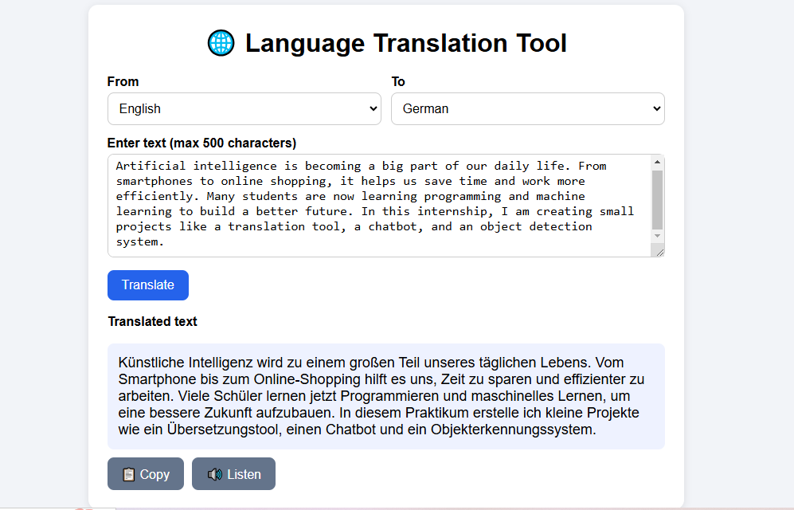
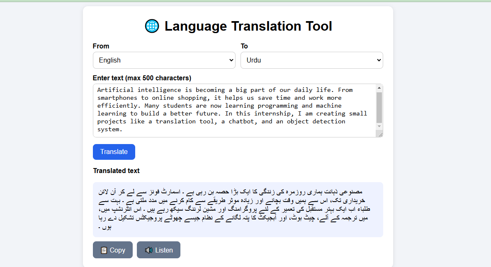
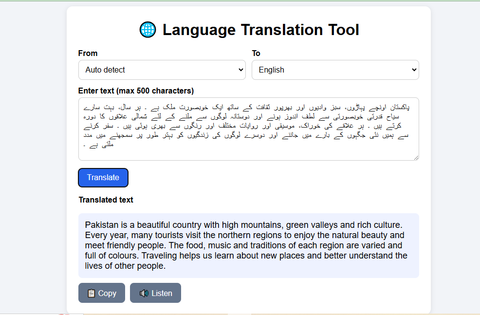
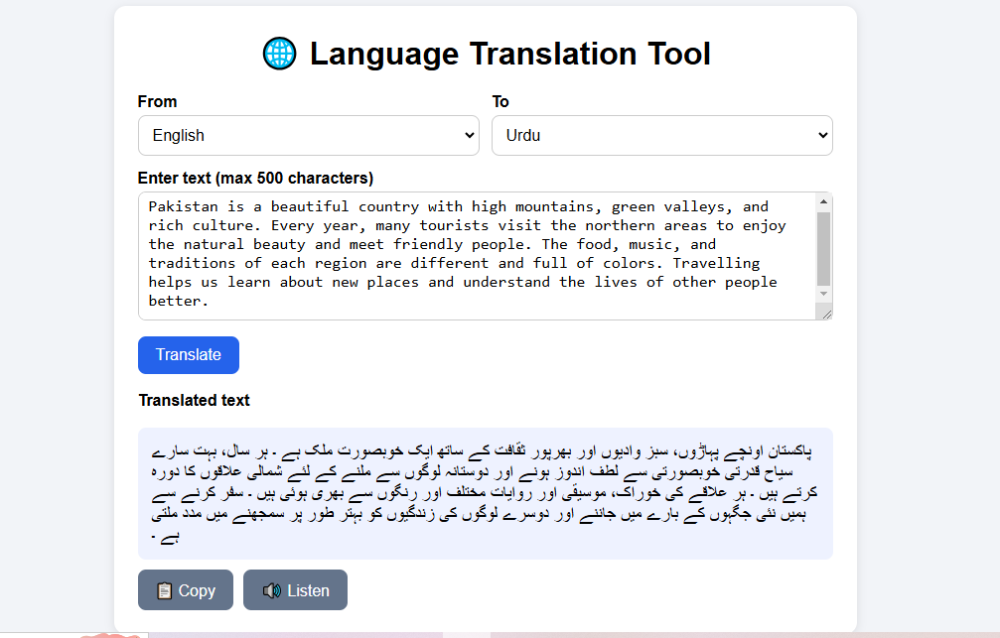

# 🌐 Language Translation Tool

A simple web app that translates text between multiple languages. Built as part of my (Task 1).

## Features
- Enter text and select the source and target language
- Auto language detection
- Translation powered by the MyMemory Translation API
- Clear display of the translated text
- Copy button to copy the translation
- Text-to-speech (🔊 Listen) to hear the translated text
- Supports 18 languages, including English, Urdu, Arabic, Hindi, French, German, Spanish and more

## Technologies Used
- HTML
- CSS
- JavaScript (Fetch API, Web Speech API)
- MyMemory Translation API

## How It Works
1. The user enters text and selects the source and target languages.
2. JavaScript sends the text to the MyMemory Translation API using `fetch()`.
3. The API returns the translated text, which is displayed on the screen.
4. The user can copy the result or listen to it using text-to-speech.

## How to Run
1. Download or clone this repository.
2. Open `index(1).html` in any modern browser (Chrome or Edge recommended).
3. An internet connection is required.

No installation or API key is needed.

## Screenshots

**English to German**

**English to Urdu**

**Auto Detect to English**

**More Examples**

## Limitations
- Maximum 500 characters per translation (free API limit).
- Online text-to-speech reads only the first 200 characters.
- Internet connection is required.

## Author
Amina Mai
